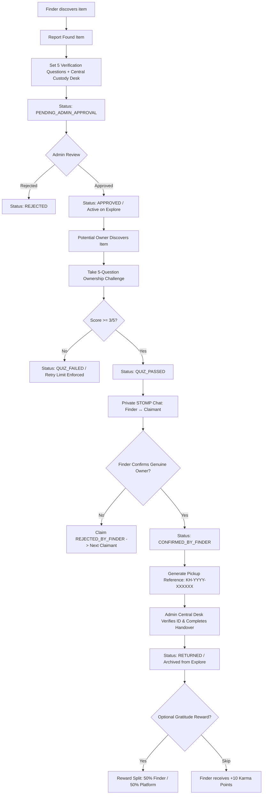
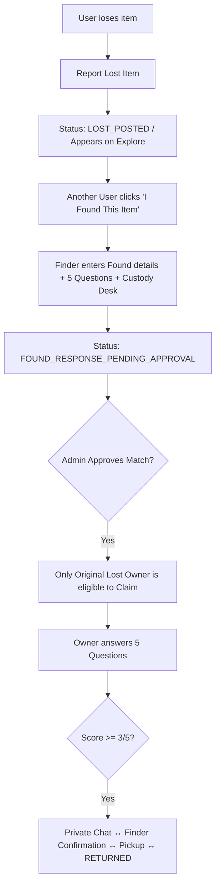

# 🔎 KhojHub — Campus & Office Lost and Found Platform

> **"Find it. Verify it. Return it."**  
> A production-grade, secure, centralized Lost & Found web platform engineered for corporate offices, university campuses, institutions, and gated communities.

---

## 📌 1. Project Overview & Problem Statement

In conventional corporate campuses and university environments:
- Belongings are physically deposited with security/receptions without a unified digital registry.
- Owners rarely know if their lost items were deposited or where they are stored.
- Fraudulent claims cannot easily be checked without structured proof of ownership.
- There is no direct, secure communication channel between finders and potential owners.
- Good Samaritans receive zero recognition or incentives for turning in lost belongings.

**KhojHub** transforms this disjointed physical process into an auditable, verified, and optionally rewarding digital lifecycle.

---

## 🏗️ 2. Architectural Overview & Tech Stack

```
   ┌─────────────────────────────────────────────────────────────┐
   │                     REACT FRONTEND (Vite)                   │
   │  - Tailwind CSS Modern Glass/Gold Aesthetic (Dark Nav)      │
   │  - Lucide Icons, STOMP.js WebSocket Client, Axios           │
   └──────────────▲───────────────────────────────▲──────────────┘
                  │ HTTPS REST APIs               │ WSS (STOMP)
                  ▼                               ▼
   ┌─────────────────────────────────────────────────────────────┐
   │                  SPRING BOOT 3 (Java 21)                    │
   │  - Spring Security (JWT + BCrypt + RBAC)                    │
   │  - Spring Data MongoDB (Atlas Cluster)                      │
   │  - Spring WebSocket + STOMP Broker Engine                   │
   │  - Multipart File Storage for Item Images                   │
   │  - Auditing & Notification Dispatcher                       │
   └──────────────────────────────┬──────────────────────────────┘
                                  │
                                  ▼
   ┌─────────────────────────────────────────────────────────────┐
   │                 MONGODB ATLAS DATABASE                      │
   │  - Collections: users, items, claims, chat_conversations,   │
   │    chat_messages, custody_records, rewards, notifications,  │
   │    audit_logs                                               │
   └─────────────────────────────────────────────────────────────┘
```

### Technology Matrix
- **Backend**: Java 21, Spring Boot 3.3.4, Spring Security, Spring Data MongoDB, Spring WebSocket (STOMP), JJWT 0.12.6, Lombok, Springdoc OpenAPI (Swagger).
- **Database**: MongoDB Atlas (`cluster0.mmkf3aj.mongodb.net/khojhub`).
- **Frontend**: React 18, Vite, Tailwind CSS, React Router v6, Axios, Lucide React, STOMP.js, Canvas Confetti.
- **DevOps & Version Control**: Git (`rohitkumar3848/Khojhub`), Docker support, root-level runner.

---

## 🔄 3. Core Business Lifecycles

### Flow A: FOUND Item Workflow


### Flow B: LOST Item Workflow


---

## 🛡️ 4. Security & Ownership Verification Rules

1. **5-Question Verification Engine**:
   - Every Found item requires 5 distinct ownership verification questions with answers.
   - The correct answers are **hashed / encrypted** and **NEVER returned** through public Explore, Item Details, or search APIs.
   - The claimant must score at least **3 out of 5** (evaluated entirely on the backend).
2. **Strict Claim Isolation**:
   - Multiple users can attempt claims on the same public found item.
   - Each claim maintains an independent `claimId`, quiz score, attempt history, and dedicated private STOMP chat conversation.
   - Claimant A can never see Claimant B's responses, status, or chat messages.
3. **No Self-Claims**:
   - A Finder cannot claim their own found item.
   - A Lost owner cannot claim their own lost item.
4. **Physical Central Custody**:
   - The digital record tracks the physical repository (e.g. *Tower B Ground Floor Security Desk*).
   - Final item handover requires physical identity verification and unique claim code `KH-YYYY-XXXXXX`.

---

## 🗄️ 5. Database Schema & Collections

| Collection | Description | Key Fields |
| :--- | :--- | :--- |
| `users` | User credentials, roles, profile, organization | `_id`, `fullName`, `email`, `passwordHash`, `roles`, `department`, `officeLocation`, `karmaPoints` |
| `items` | Lost & Found records, categories, custody | `_id`, `title`, `description`, `type`, `category`, `status`, `location`, `centralDropLocation`, `verificationQuestions` |
| `claims` | Claim requests and verification scores | `_id`, `itemId`, `claimantUserId`, `finderUserId`, `score`, `status`, `pickupReferenceCode` |
| `chat_conversations` | Item + Claim specific chat channels | `_id`, `itemId`, `claimId`, `participantIds`, `status` |
| `chat_messages` | Real-time chat messages | `_id`, `conversationId`, `senderId`, `senderName`, `message`, `createdAt` |
| `custody_records` | Physical storage & handover audit | `_id`, `itemId`, `locationName`, `receivedByAdminId`, `handoverToUserId`, `status` |
| `rewards` | Gratitude transactions & accounting | `_id`, `claimId`, `claimantId`, `finderId`, `totalAmount`, `finderAmount`, `platformAmount`, `paymentStatus` |
| `notifications` | In-app alerts for state changes | `_id`, `userId`, `title`, `message`, `type`, `linkUrl`, `read` |
| `audit_logs` | Security & moderation audit trails | `_id`, `actorId`, `actorEmail`, `action`, `entityType`, `entityId`, `timestamp`, `details` |

---

## 🔌 6. REST API Endpoints

### 🔐 Authentication (`/api/v1/auth`)
- `POST /register` — Register a new student/employee.
- `POST /login` — Authenticate and receive JWT token.
- `GET /me` — Fetch currently authenticated user session.

### 📦 Items (`/api/v1/items`)
- `GET /` — Search and filter active items (with category, building, date, query).
- `GET /{id}` — Fetch item details (sanitized, answers redacted).
- `POST /found` — Create found item with 5 questions & drop location.
- `POST /lost` — Create lost item report.
- `POST /{id}/found-response` — Respond to a lost item with found details.
- `GET /my-posts` — Fetch items posted by current user.
- `DELETE /{id}` — Delete user post (or admin delete).

### 🏷️ Claims (`/api/v1/claims`)
- `POST /items/{itemId}/claim` — Submit 5 answers for verification challenge.
- `GET /my` — List all claims made by current user.
- `GET /{claimId}` — Get detailed claim status.
- `POST /{claimId}/confirm` — Finder confirms claimant as genuine owner.
- `POST /{claimId}/reject` — Finder rejects claimant.

### 💬 Real-Time Chat (`/api/v1/chats` & WebSocket)
- `GET /my` — List active user chat conversations.
- `GET /{conversationId}/messages` — Retrieve message history.
- `POST /{conversationId}/send` — Send a message (REST fallback).
- WebSocket STOMP endpoint: `/ws`, destination: `/app/chat.send`, topic: `/topic/conversation/{conversationId}`.

### 🛡️ Admin Moderation & Operations (`/api/v1/admin`)
- `GET /dashboard/stats` — Metrics (users, items, approvals, claims, returned).
- `GET /items/pending` — List pending found items and lost-to-found matches.
- `POST /items/{id}/approve` — Approve pending found item.
- `POST /items/{id}/reject` — Reject inappropriate or duplicate item.
- `POST /custody/handover` — Complete handover using claim code `KH-YYYY-XXXXXX`.
- `GET /users` — View and manage users.
- `GET /audit-logs` — View system audit trails.

### 🎁 Rewards (`/api/v1/rewards`)
- `POST /` — Initiate gratitude reward payment (or record skip for +10 Karma points).
- `GET /my` — View user's reward and karma history.

---

## 🚀 7. Running the Application Locally

### Prerequisites
- **Java 21 LTS**
- **Apache Maven 3.9+**
- **Node.js 20+ & npm**
- **MongoDB Atlas** connection configured

### One-Command Quick Start
From the project root:
```bash
# 1. Install root dependencies (concurrently)
npm install

# 2. Run both backend and frontend concurrently
npm run dev
```

Or run services independently:
```bash
# Backend (port 8080)
cd backend
mvn spring-boot:run

# Frontend (port 5173)
cd frontend
npm install
npm run dev
```

---

## 🎨 8. UI/UX Aesthetic
The interface adheres strictly to the provided design mockups:
- **Header**: Deep Navy Slate (`#0B132B` / `#1C2541`) with golden-amber accents (`#F59E0B`).
- **Hero**: Clean callout banners with dual call-to-actions ("Report Lost" & "Report Found").
- **Cards**: Rich typography, thumbnail preview, categorical tags, physical custody tags, and quick-claim triggers.
- **Verification Modal**: Intuitive 5-question challenge with real-time feedback.
- **Responsive**: Mobile-first grid adapting seamlessly from phones to desktop monitors.

---

*Engineered with precision for secure, honest, and joyful community recovery.*
